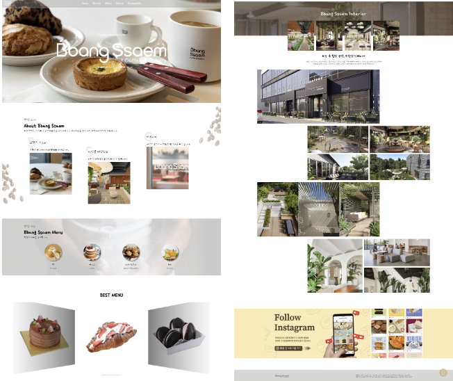
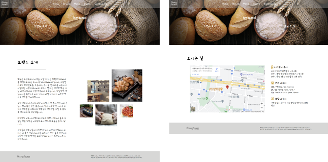
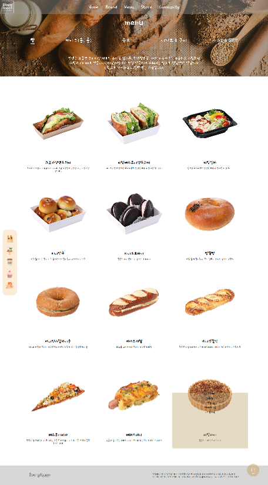
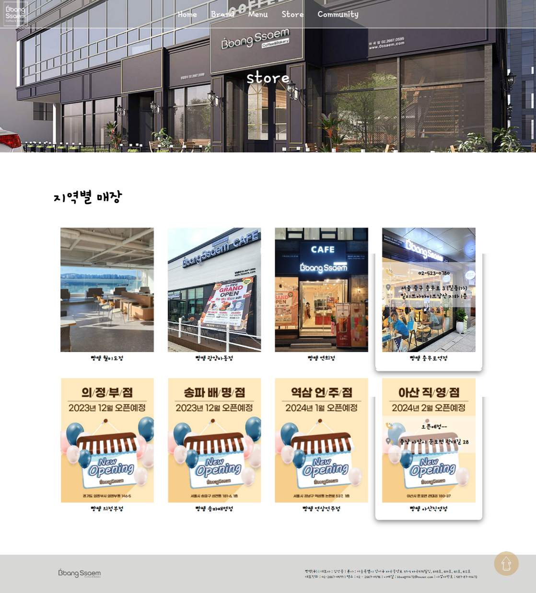
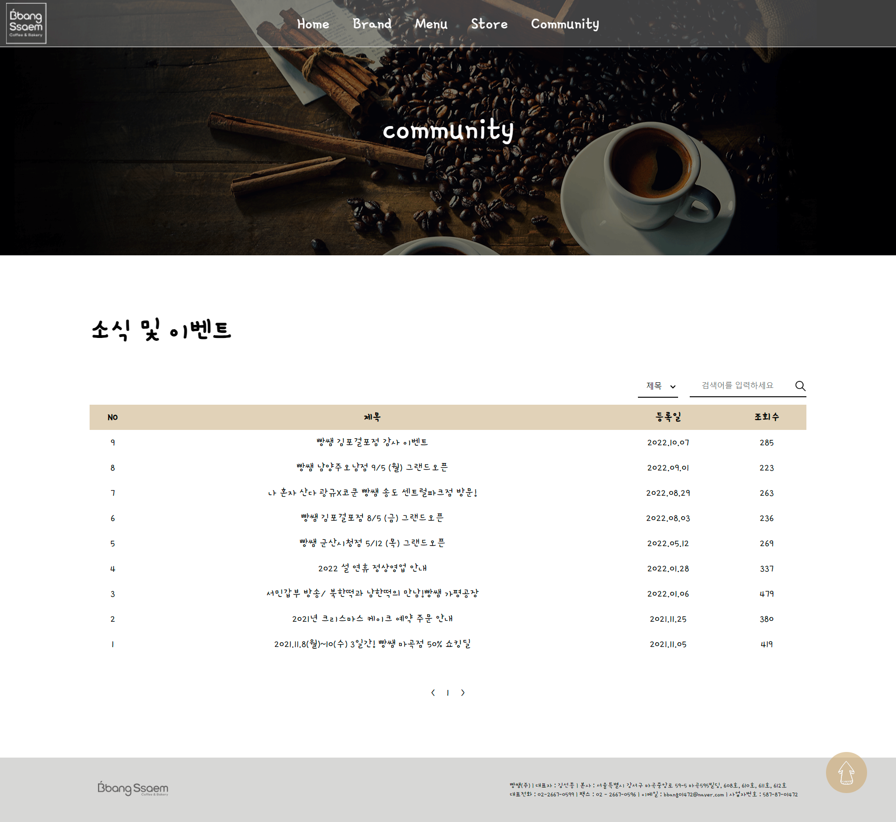

## 🍞 포트폴리오 소개
- 주색: #c4aa77
- 벤치마킹 사이트 : http://www.0ssaem.com/
- 반응형
		
## 🥯 페이지 구성
#### 🥪 메인페이지
 

- 메인베너 2초마다 바뀜 
- 스크롤시 헤더 배경색 변경
- 마우스 휠 이벤트로 section 이동 
- 메뉴 호버시 크기 커지고 클릭시 메뉴 페이지로 이동
- best menu 스와이퍼 기능 (자동으로 돌아가고 드래그 가능)
- 인테리어 사진 호버시 위로 살짝 이동
- 빵쌤소개, 인테리어 부분 스크롤 이벤트
- 인스타그램 베너 클릭시 인스타그램으로 페이지 이동 
- 스크롤 시 top 버튼 보이고 클릭시 해당 페이지의 맨 위로 이동
 
#### 🥖 브랜드 페이지

- 브랜드 소개 / 오시는 길 클릭시 선택된 부분 밑줄, 해당 내용 보임
- 지도 iframe 사용 

#### 🥨 메뉴 페이지

- 빵 / 케이크 / 음료 / 디저트 / MD 클릭시 선택된 부분 밑줄, 해당 내용 보임
- 스크롤시 헤더 배경색 변경
- 메뉴 호버시 배경색, 상세 내용 보여짐
- 스크롤 시 왼쪽에 메뉴 아이콘 나타나고 클릭시 해당 내용의 메뉴들이 보여짐
- 스크롤 시 top 버튼 보이고 클릭시 해당 페이지의 맨 위로 이동

#### 🥐 스토어 페이지

- 매장 호버시 매장정보(전화번호, 위치) 보여짐 
- 매장 클릭시 지도(길찾기)로 페이지 이동 
- 스크롤 시 top 버튼 보이고 클릭시 해당 페이지의 맨 위로 이동

#### 🥞 커뮤니티 페이지

- 이벤트 제목 클릭시 이벤트 상세 페이지로 이동

